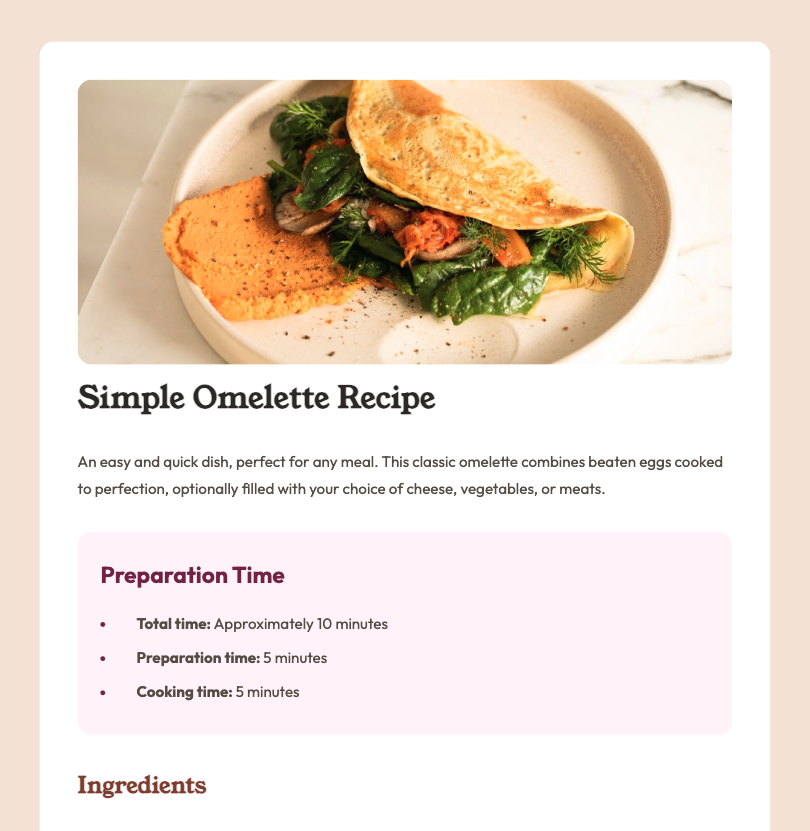

## Table of contents

- [Table of contents](#table-of-contents)
- [Overview](#overview)
  - [Screenshot](#screenshot)
  - [Links](#links)
- [My process](#my-process)
  - [Built with](#built-with)
  - [What I learned](#what-i-learned)
- [Author](#author)

## Overview

### Screenshot



### Links

- Solution URL: [Add solution URL here](https://github.com/ejparnell/recipe-page)
- Live Site URL: [Add live site URL here](https://ejparnell.github.io/recipe-page/)

## My process

### Built with

- Semantic HTML5 markup
- CSS custom properties
- Flexbox
- CSS Grid
- Mobile-first workflow

### What I learned

I learned about `text-indent` and how to use it to indent the first line of a paragraph. I have not had to use this property before, so it was a good learning experience.

What this property does is it indents the first line of text in an element. The amount of indentation is specified in the value of the property. The value can be in pixels, ems, or percentages.

Here is an example of how I used it in my project:

```css
li {
    margin-bottom: 8px;
    color: var(--rose-800);
    text-indent: -16px;
    padding-left: 16px;
}
```

## Author

- LinkedIn - [Beth Parnell](https://www.linkedin.com/in/elizabethjparnell/)
- GitHub - [@ejparnell](https://github.com/ejparnell)
